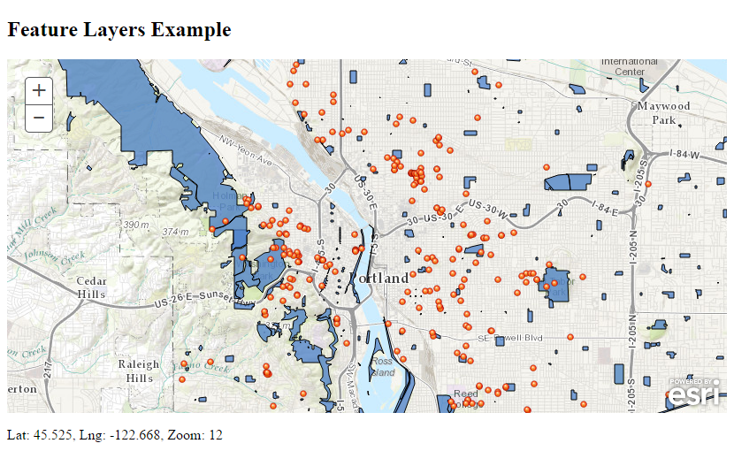

angular-esri-map
================

**The angular-esri-map repository is now retired and will soon be archived (Q4 2020). It started in Long Term Maintenance mode on July 1, 2018.**

Do you have a question related to JavaScript that isn’t specific to Angular? Post these questions in the [GeoNET](https://community.esri.com/community/developers/web-developers/arcgis-api-for-javascript) forum for the ArcGIS API for JavaScript.

Please take a look at these modern alternatives:

- [Esri-loader](https://github.com/esri/esri-loader) - A tiny library to help load ArcGIS API for JavaScript modules in non-Dojo applications.
- [Arcgis-webpack-plugin](https://github.com/Esri/arcgis-webpack-plugin) – A webpack wrapper for the ArcGIS API for JavaScript.
- [Angular-cli-esri-map](https://github.com/Esri/angular-cli-esri-map) – A repo that demos using the ArcGIS API for JavaScript in Angular 9+ applications.

---

A collection of directives to help you use Esri maps and services in your AngularJS v1.x applications.

These directives can be used as-is if your mapping needs are simple, or as reference examples of the patterns that you can use to write your own directives that use the ArcGIS API for JavaScript. [Read more...](https://arcgis.github.io/angular-esri-map-site-v1/#/patterns)

## Table of Contents

- [Getting Started](#getting-started)
  - [Quick Start](#quick-start)
  - [Lazy Loading of the ArcGIS API for JavaScript](#lazy-loading-of-the-arcgis-api-for-javascript)
- [Dependencies](#dependencies)
- [Resources](#resources)
- [What about Angular 2?](#what-about-angular-2)
- [What about Ionic?](#what-about-ionic)
- [Issues](#issues)
- [Contributing](#contributing)
- [Development Instructions](#development-instructions)
- [Licensing](#licensing)

## Getting Started

Here are [examples and guides](https://arcgis.github.io/angular-esri-map-site-v1/) showing how you can use this module to bring Esri maps into your own AngularJS v1.x applications.

### Quick Start

To use these directives in your own AngularJS v1.x application, first install the module as a dependency using any of the following methods.

```html
<!-- load angular-esri-map from CDN -->
<script src="https://unpkg.com/angular-esri-map@1"></script>
```

```bash
# OR install via bower
bower install angular-esri-map

# OR install via npm
npm install angular-esri-map
```

Alternatively, you can clone or [download](https://github.com/Esri/angular-esri-map/releases) this repo and copy the desired module file (`angular-esri-map.js` or `angular-esri-map.min.js`) into your application.

Once you've added the module to your application, you can refer to the sample code below to use the `<esri-map>` directive. If you have downloaded or installed locally, point to the location of the module file in your environment (instead of CDN) and load the page in a browser.



```html
<!DOCTYPE html>
<html ng-app="esri-map-example">
    <head>
        <title>AngularJS Esri Quick Start</title>
        <meta name="viewport" content="initial-scale=1.0, user-scalable=no">
        <meta charset="utf-8">
        <link rel="stylesheet" type="text/css" href="https://js.arcgis.com/3.21/esri/css/esri.css">
    </head>
    <body ng-controller="MapController as vm">
        <esri-map id="map" center="vm.center" zoom="vm.zoom" basemap="topo">
            <esri-feature-layer url="//services.arcgis.com/rOo16HdIMeOBI4Mb/arcgis/rest/services/Heritage_Trees_Portland/FeatureServer/0"></esri-feature-layer>
            <esri-feature-layer url="//services.arcgis.com/rOo16HdIMeOBI4Mb/arcgis/rest/services/Portland_Parks/FeatureServer/0"></esri-feature-layer>
        </esri-map>
        <p>Lat: {{ vm.center.lat | number:3 }}, Lng: {{ vm.center.lng | number:3 }}, Zoom: {{ vm.zoom }}</p>

        <!-- load Esri JSAPI -->
        <script src="https://js.arcgis.com/3.21compact"></script>
        <!-- load AngularJS -->
        <script src="https://ajax.googleapis.com/ajax/libs/angularjs/1.6.5/angular.js"></script>
        <!-- load angular-esri-map -->
        <script src="https://unpkg.com/angular-esri-map@1"></script>

        <script>
            angular.module('esri-map-example', ['esri.map'])
                .controller('MapController', function() {
                    var self = this;
                    self.center = {
                        lng: -122.676207,
                        lat: 45.523452
                    };
                    self.zoom = 12;
                });
        </script>
    </body>
</html>
```

See the documentation for [examples and guides](https://arcgis.github.io/angular-esri-map-site-v1) of how to use the other directives and services.

### Lazy Loading of the ArcGIS API for JavaScript

If your application only shows a map under certain conditions you may want to lazy load the ArcGIS API for JavaScript. You can do this by calling the `esriLoader.bootstrap()` method. See the [Lazy Load Patterns page](https://arcgis.github.io/angular-esri-map-site-v1/#/patterns/lazy-load) for an example of how to do this.

## Dependencies

These directives and services require, at a minimum, AngularJS v1.3.0 and the ArcGIS API for JavaScript v3.12 (though most will work and are tested on v3.11).

angular-esri-map | AngularJS | ArcGIS API for JavaScript | Notes
--- | --- | --- | ---
v1.0.0 | v1.3 - v1.5 | [v3.12 - 3.21](https://developers.arcgis.com/javascript/3/) | Test coverage included for AngularJS v1.3.
v1.1.0 | v1.3 - v1.5 | [v3.15 - 3.21](https://developers.arcgis.com/javascript/3/) |
v1.1.8 | v1.3+ | [v3.15 - 3.21](https://developers.arcgis.com/javascript/3/) | Due to a breaking change in controllers at AngularJS v1.6, e2e test coverage has been performed with v1.3, but will only continue with v1.6. See [CHANGELOG](https://github.com/Esri/angular-esri-map/blob/v1.x/CHANGELOG.md#v118).

## Resources

**Websites**
* [AngularJS v1.x](https://angularjs.org/)
* [ArcGIS API for JavaScript](https://developers.arcgis.com/javascript/)
* [ArcGIS for Developers](https://developers.arcgis.com)
* [ArcGIS REST API](https://resources.arcgis.com/en/help/arcgis-rest-api/)
* [@Esri](https://twitter.com/esri)

**Presentations**
* [Declarative Mapping Applications with AngularJS and the ArcGIS API for JavaScript](https://proceedings.esri.com/library/userconf/devsummit16/papers/dev_int_193.pdf), Esri 2016 International Developer Summit
* [ArcGIS API for JavaScript and AngularJS: What's New, What's Next](https://jwasilgeo.github.io/esri-jsapi-and-angular-whats-next-dev-summit-2016), Esri 2016 International Developer Summit
* [Angular and the ArcGIS API for JavaScript](https://jwasilgeo.github.io/presentations/2017/angular-and-the-arcgis-api-for-javascript), Esri 2017 International Developer Summit

## What about Angular 2?

You can find up to date information on [using the ArcGIS API for JavaScript in an Angular (2+) application at this Angular resources page](https://github.com/esri/jsapi-resources/tree/master/frameworks/angular). [`esri-loader`](https://github.com/esri/esri-loader) is the preferred way to load ArcGIS API for JavaScript modules in Angular (2+) applications.

## What about Ionic?

Ionic is a mobile-ready implementation of Angular that is built on top of Cordova/PhoneGap. The coding patterns shown above can also be used with Ionic.

* [andygup/ionic2-esri-map](https://github.com/andygup/ionic2-esri-map): Example using ArcGIS API for JavaScript with Ionic2 using the angular2-esri-loader pattern with webpack.
* [jwasilgeo/ionic-esri-map](https://github.com/jwasilgeo/ionic-esri-map): An Ionic1 app showing how to integrate a map using the angular-esri-map v1 pattern.

## Issues

Find a bug or want to request a new feature? Please let us know by submitting an issue. Thank you!

## Contributing

Anyone and everyone is welcome to contribute. Please see our [guidelines for contributing](https://github.com/Esri/angular-esri-map/blob/master/CONTRIBUTING.md).

## Development Instructions

Make sure you have [Node](https://nodejs.org/) and [Gulp](https://github.com/gulpjs/gulp/blob/master/docs/getting-started.md#getting-started) installed.

1. [Fork and clone this repo](https://help.github.com/articles/fork-a-repo)
2. `cd` into the `angular-esri-map` folder
3. Install the dependencies with `npm install`
4. run `gulp` from the command line. This will run the linting and build commands and then start a local web server hosting the application under the `docs` folder
5. Modify the source files (under `src`) and test pages (under `test`). Test pages are served along with the docs site when you run the `gulp` task and are accessible from the root (i.e. `https://localhost:9002/simple-map.html`).
6. Make a [pull request](https://help.github.com/articles/creating-a-pull-request) to contribute your changes

## Licensing
Copyright 2014 Esri

Licensed under the Apache License, Version 2.0 (the "License");
you may not use this file except in compliance with the License.
You may obtain a copy of the License at

   https://www.apache.org/licenses/LICENSE-2.0

Unless required by applicable law or agreed to in writing, software
distributed under the License is distributed on an "AS IS" BASIS,
WITHOUT WARRANTIES OR CONDITIONS OF ANY KIND, either express or implied.
See the License for the specific language governing permissions and
limitations under the License.

A copy of the license is available in the repository's [license.txt](https://raw.github.com/Esri/angular-esri-map/master/LICENSE) file.
